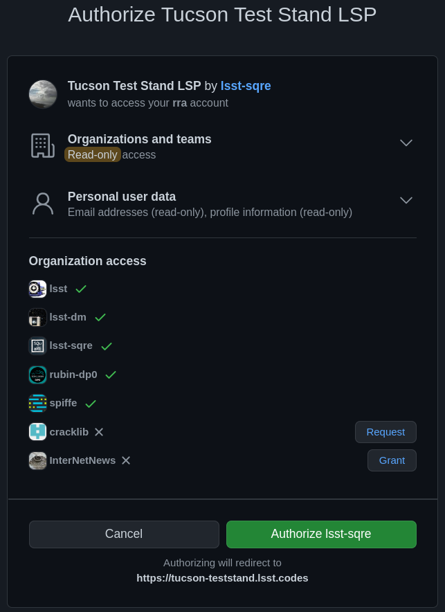

##################################
Releasing GitHub organization data
##################################

This applies only to Science Platform environments that use GitHub for authentication, not to ones that use CILogon or a local identity provider.

When the user is sent to GitHub to perform an OAuth 2.0 authentication, they are told what information about their account the application is requesting, and are prompted for which organizational information to release.
Since we're using GitHub for group information, all organizations that should contribute to group information (via team membership) must have their data released.
GitHub supports two ways of doing this: make the organization membership public, or grant the OAuth App access to that organization's data explicitly.

GitHub allows the user to do the latter in the authorization screen during OAuth 2.0 authentication.

   The authorization screen shown by GitHub during an OAuth App authentication.
   The organizations with green checkmarks either have public membership or that OAuth App was already authorized to get organization data from them.
   The "InterNetNews" organization does not share organization membership but allows any member to authorize new OAuth Apps with the :guilabel:`Grant`.
   The "cracklib" organization does not share organization membership and requires any new authorizations be approved by administrators, which can be requested with :guilabel:`Request`.

This UI is not very obvious for users, and for security reasons we may not wish users who are not organization administrators to be able to release organization information to any OAuth App that asks.
Therefore, either organization membership should be set to public for all organizations used to control access to Science Platform deployments protected by GitHub, or someone authorized to approve OAuth Apps for each organization that will be used for group information should authenticate to the Science Platform deployment and use the :guilabel:`Grant` button to grant access to that organization's data.
