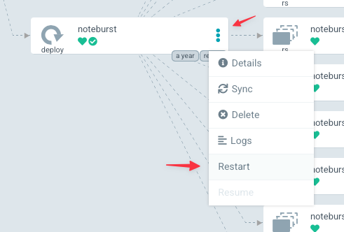

#######################################
Deploying from a branch for development
#######################################

When developing applications and their :doc:`Helm charts <helm-chart/index>`, it's useful to temporarily deploy from a branch of Phalanx on :doc:`designated development environments </environments/index>` before merging to Phalanx's default branch.

Some use cases include:

- Testing that a new or updated Helm chart works in a higher-fidelity environment than the Minikube GitHub Actions CI cluster.
- Testing how a new or updated application interacts with other deployed applications and cluster infrastructure like databases.

Through this process it is possible to develop an application in a fairly tight loop, though it's best to augment this practice with unit tests within the application's codebase.

.. seealso::

   This page focuses on using a development environment to iteratively develop and test changes to an application, ultimately yielding a application upgrade in Phalanx.
   You can achieve the same result without the iterative deployment testing by following the steps in :doc:`upgrade`.

   If you are deploying an application in an environment where it is not currently running, either because the application is brand new or because you're adding it to an additional environment, see :doc:`switch-environment-to-branch`.

.. _deploy-branch-prep:

Preparing and pushing a branch
==============================

Start by creating a branch of the `phalanx repository`_ and editing your application.
Do not use a GitHub fork; the steps below require that your change be on a branch in that repository.

You can make many types of edits to the application.
The most straightforward changes are updates to your application's Docker images or the Helm sub-charts the application depends on.
See :doc:`upgrade`.
You can also make changes to the Helm values by editing the application's defaults in its :file:`values.yaml` file, or the values for the development environment in the corresponding :file:`values-{environment}.yaml` file.
Finally, you can also make changes to the Helm templates for Kubernetes resources.

Commit your changes and push your branch to GitHub.
Throughout this process, you can continue to commit changes and push updates to your branch to GitHub.

.. tip::

   When testing development versions of a service, it's useful to force Kubernetes to pull the application's Docker images every time a Pod_ starts up.
   This way you can push edits to the Docker images with a specific development tag [1]_ and then have your test deployment use those updated images.
   This setting is controlled by the ``imagePullPolicy`` key in Deployment_ resources (and specifically their Pods_).
   In typical application Helm charts the image pull policy is accessible from Helm values.
   In the application's Helm values file for the development environment, set this pull policy to ``Always``:

   .. code-block:: yaml
      :caption: applications/<application>/values-<environment>.yaml

      image:
        pullPolicy: Always

   Consult the Helm values documentation for your application for details.

   .. [1] SQuaRE Docker images are tagged with the Git branch or tag they are built from, with a typical branch build for a ticket branch being tagged as :samp:`tickets-DM-NNNNN`.

Switching the Argo CD Application to sync the branch
====================================================

By default, Argo CD syncs your application from the default branch (``main``) of the `phalanx repository`_.
Change the application in Argo CD to instead sync from the branch you've pushed to GitHub:

1. Open your application's page in your environment's Argo CD UI.
   You can find that URL by going to the documentation page for your application under :doc:`the application list </applications/index>` and choosing the Argo CD link for the relevant environment.

2. Click on the resource of type ``Application``.
   In the tree view this is the root node.

   .. image:: argocd-application.jpg

3. Click on the :guilabel:`Edit` button in the :guilabel:`Summary` pane.

   .. image:: application-edit-button.jpg

4. Edit the application to sync from your branch:

   1. Edit the :guilabel:`Target revision` field and enter your branch's name.
   2. Finally, click on the :guilabel:`Save` button.

   .. image:: application-revision-edit.jpg

5. In the application's page in Argo CD, click on the :guilabel:`Sync` button to redeploy the application from your branch.

   .. image:: sync-button.jpg

Once you have done this, the ``science-platform`` Argo CD application will show as out of sync.
This is correct (you have manually modified it), and serves as a helpful reminder that this application is running from a branch.

Updating the application's Helm chart
=====================================

While your application is in active development, you may need to update its Helm chart and corresponding Kubernetes resources.
There are two ways of approaching these updates.

.. _updating-resources-in-argo-cd:

Editing resources directly in Argo CD
-------------------------------------

The fastest method for trying out changes to Kubernetes resources is to directly edit those resources in the Argo CD UI.
In your application's Argo CD page you can click on a specific resource (such as a ConfigMap_ or Deployment_) and click the :guilabel:`Edit` button on the live manifest.
Make your changes, then click :guilabel:`Save`.

Changes made to a ``ConfigMap`` are often not automatically applied, since pods usually read their ``ConfigMap`` on startup and never again.
If you change a ``ConfigMap``, you may therefore have to restart the relevant deployments to pick up that change.
For instructions on how to do that, see :ref:`branch-deploy-restart`.

After you have made this type of manual edit, the application will show as out of sync, since its configuration in the Kubernetes cluster no longer matches its configuration in Phalanx.
If you click the :guilabel:`Sync` button, it will revert your changes and again make the application match its Phalanx configuration.

.. important::

   Edits to resources via the Argo CD UI are temporary.
   To make permanent changes, you need to edit the application's Helm chart in the `phalanx repository`_.

.. _updating-and-resyncing-from-branch:

Updating and resyncing from the branch
--------------------------------------

When you have edited your application's Helm chart in your development branch of the `phalanx repository`_, you need to sync those changes to Kubernetes.

Argo CD generally refreshes automatically.
If you have pushed your branch to GitHub and Argo CD doesn't show that your application is out-of-sync, you can click the :guilabel:`Refresh` button on your application's Argo CD page.

When your application shows an out-of-sync status, you can click the :guilabel:`Sync` button on your application's Argo CD page.
When individual applications are synchronized their status changes from yellow to green.

In some cases you many also need to restart Pods_ in Deployments_ to see changes take affect.
See :ref:`branch-deploy-restart`.

Refreshing a deployment's Docker images
=======================================

Besides developing the Helm chart, you can also test branch builds of your application's Docker images inside Deployment_ resources.

To start, ensure that the Deployment_ is using development builds of your application's Docker images.
The best way to do this is to edit the application's Helm chart for the application in the development environment and to :ref:`sync those changes <updating-and-resyncing-from-branch>`.
For development changes, you should usually override just the ``image.tag`` setting in the :file:`values-{environment}.yaml` file for that environment, which makes it clear that this change is temporary.
Save changes to the ``appVersion`` in :file:`Chart.yaml` for new releases.

You should also ensure that the Deployment_ is always pulling new images, rather than caching them, by setting the ``imagePullPolicy`` to ``Always``.
This is covered in :ref:`deploy-branch-prep`.

When new Docker images for your application are available with the corresponding branch tag from a container repository, you will need to restart the deployments using those images.
See :ref:`branch-deploy-restart`.

.. _branch-deploy-restart:

Restarting a Deployment
=======================

Some changes won't affect a running Deployment_.
For example, many deployments only read ConfigMap_ or Secret_ resources when Pods_ initially start up.
To realize an update, you'll see to restart the Pods_ in Deployments_.

To restart a deployment, find the ``Deployment`` resources in your application's Argo CD page, click on the three-vertical-dots icon, and select :guilabel:`Restart` from the menu.
New pods will appear while old pods will shut down.

   The ``Deployment`` drop-down menu.
   Click on the three-vertical-dots to open the drop-down menu for a ``Deployment`` resource.
   Select the :guilabel:`Restart` item to restart the deployment.

If the new pods fail to start, they will show a "crash-loop backoff" status and the old pods will continue to operate.
You'll need to resolve the error with changes to the application's Docker image and/or Helm charts.
After making fixes, you may need to restart the Deployment again.

Merging and switching the Argo CD Application to the default branch
===================================================================

Once development and testing is complete, you should submit the pull request for review following the `Data Management workflow guide`_.
Once your branch is merged, remember to reset your application's Argo CD ``Application`` resource to point back to the default branch (``main``).

#. Open your application's page in your environment's Argo CD UI.
   You can find that URL by going to the documentation page for your application under :doc:`the application list </applications/index>` and choosing the Argo CD link for the relevant environment.

#. Click on the resource of type ``Application``.
   In the tree view this is the root node.

#. Click on the :guilabel:`Edit` button in the :guilabel:`Summary` pane:

   - Edit the :guilabel:`Target revision` field back to the default branch (``main``).
   - Finally, click on the :guilabel:`Save` button.

#. In the application's page in Argo CD, click on the :guilabel:`Sync` button to redeploy the application from the default branch.

Next steps
==========

While following these instructions, you have iterated on the development of your application and ultimately upgraded that application in a development environment.
The next step is to roll out this change to other environments.
This activity is normally done by the administrators for each environment.
See :doc:`/admin/sync-argo-cd` for more details.
