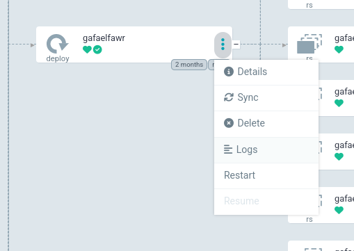
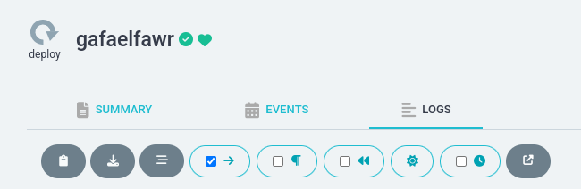

########################
Getting application logs
########################

Find logs in Argo CD
====================

To see the logs for your application, use Argo CD:

#. Go to the Argo CD UI for the environment for which you want to see logs.
   To find the link to the Argo CD UI, go to the :doc:`page for that environment </environments/index>`.

#. Click on the application whose logs you want to see.
   If you don't see your application, you probably have filters set that are preventing you from seeing your application.
   Look at the left-hand sidebar under filters and clear filters that may be hiding your application.

#. Argo CD will display the Kubernetes resources for your application.
   Find the ``Deployment`` resource, which Argo CD identifies with a :guilabel:`deploy` keyword and an icon of a circular arrow.
   Your application may have multiple ``Deployment`` resources for ancillary services; find the one that will have the logs that you want to see.

#. In the box for the relevant deployment resource, click on the three vertical dots down the right-hand side to bring up the context menu.
   Select :menuselection:`Logs` from that menu.

Here is what that selection will look like:

This will bring up Argo CD's built-in log viewer.

Using the Argo CD log viewer
============================

You can configure its behavior with the icons along the top above the log lines.

The icon with the downward arrow in a circle (second leftmost one) toggles whether to constantly scroll to the bottom of the window when new log lines appear.
Turn this off if you need time to examine one log line.

The first drop-down menu allows you to select which container's logs to view.
If your application has multiple containers in its pods (if, for example, it has a sidecar container such as a Cloud SQL Auth Proxy), you may have to select the container with the interesting application logs.
By default, the alphabetically first container is shown.

Downloading logs
================

The Argo CD log viewer is very limited and cannot show very much history.
Often it's easier to download all of the logs and then search and analyze them locally.
To do this, click on the icon with an arrow pointing down at a line (the second icon from the right).
This will download all of the logs buffered by Kubernetes, which is usually at least an hour.
(This is equivalent to running ``kubectl logs`` on the relevant pods.)

Getting older logs
==================

Logs older than that may or may not be available depending on whether this Science Platform environment is running somewhere that captures older logs.
For Science Platform environments hosted by Google Kubernetes Engine, older logs can be viewed and searched by going to `Log Explorer <https://cloud.google.com/logging/docs/view/logs-explorer-interface>`__ for that Google Cloud Platform project.
