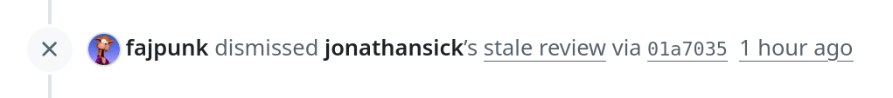
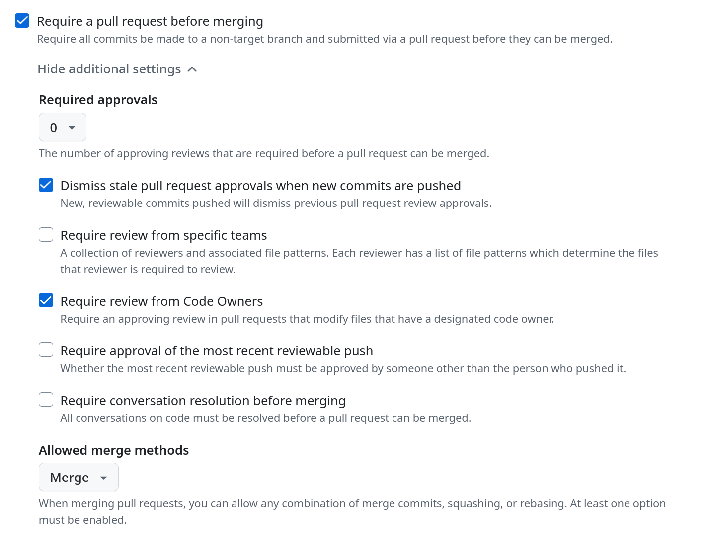

#################
GitHub CODEOWNERS
#################

Every change to the Phalanx ``main`` branch must come in through a pull request.
This is enforced in a GitHub ruleset that targets the ``main`` branch.
By default, no PR approvals are required to merge a PR.
If you want to require at least one review from specific people or GitHub teams, you can use GitHub's `CODEOWNERS`_ functionality.

At its most basic, each line in the ``CODEOWNERS`` file at the root of the Phalanx repo contains a filepattern and then a list of people and/or teams.
One person from that list must approve any PRs that modify any files that match the filepattern.
For example, this line says that any PR that modifies any files in the ``/applications/argo-workflows/`` directory must be approved by at least one person from either the ``codeowners-observatory`` or ``square`` teams in the ``lsst-sqre`` organization.

.. code-block::

   /applications/argo-workflows/ @lsst-sqre/codeowners-observatory @lsst-sqre/square

.. _CODEOWNERS: https://docs.github.com/en/repositories/managing-your-repositorys-settings-and-features/customizing-your-repository/about-code-owners

General ruleset config
======================

The Phalanx repository is configured so that:

* PRs that don't modify any files covered by the ``CODEOWNERS`` file don't require any approvals to merge.
* PRs that modify files covered by the ``CODEOWNERS`` file require at least one approval from a configured owner.
* PRs that modify owned files require another approval if there are any changes (even to non-owned files) after an owner has approved the PR.

PRs that don't have any owned files, but have approvals will now display this message if any further commits are pushed:

The PR can still be merged at any time.
Unfortunately, there is no way to get rid of these messages if we want to also enforce codeowner approval elsewhere in the repo.

This is how the delicate configuration of the ruleset looks in the GitHub UI:

